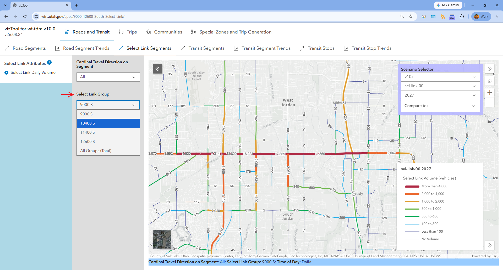

```{python}
#| label: setup
import os
import sys

sys.path.insert(0, os.path.join('..', '..'))
import report_data as rd

RUN_SET_ID = "udot-sel-link"
```

**[← All run sets](../../index.qmd)**

```{python}
#| echo: false
#| output: asis
from IPython.display import Markdown, display

byline = rd.run_set_byline(RUN_SET_ID)
if byline:
    display(Markdown(f"*{byline}*"))
```

## Background

Grant Farnsworth, UDOT's Region Two Traffic Operations Engineer, requested
this analysis on behalf of their region team, who were discussing how to
prioritize improvements across different east/west road segments: a
select-link analysis on 9000 South, 10600 South, 11400 South, and 12600
South, at points roughly midway between Bangerter Highway and Redwood Road,
with a turnaround of about a month.

## Overview

At UDOT's request, this run set performs a select link analysis on the
Wasatch Front Regional Travel Demand Model, isolating the trips that travel
through four corridor crossings: **9000 South, 10600 South, 11400 South, and
12600 South**. A select link analysis traces every trip in the model that
uses a chosen link, showing where those trips come from and where they're
headed — which is what makes it useful for understanding how traffic on a
specific segment relates to the surrounding travel pattern, rather than just
how much volume passes through it.

This run uses the **WF-TDM v10x-C70** model with a **2027 roadway network**
and **2026 socioeconomic (SE) data**.

There isn't currently an indicator on the map showing the specific segment
selected for the analysis — it will be the segment with the highest volume
on each roadway.

## Explore the results

The full interactive results — mapped trip origins and destinations,
segment volumes, and corridor-level detail for each of the four crossings —
are published as a standalone interactive tool rather than reproduced here:

<p style="text-align:center; margin: 2em 0;">
  <a href="https://wfrc.utah.gov/apps/9000-12600-South-Select-Link/"
     style="display:inline-block; padding: 0.75em 1.5em; background:#1B3A5C;
            color:#fff; border-radius:4px; text-decoration:none; font-weight:bold;">
    Open the Select Link Explorer &rarr;
  </a>
</p>

That tool lets you filter by direction and by select-link group, and to
browse the underlying corridor and travel-shed detail interactively rather
than through a static report.

## Picking a corridor

Once you're in the explorer, the **Select Link Group** dropdown is what
switches between the four crossings (9000 S, 10400 S, 11400 S, 12600 S) —
select one, or "All Groups (Total)" to see combined volume across all four.


